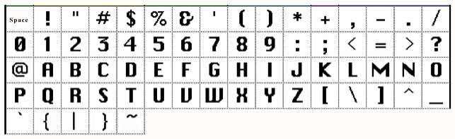

# 1.3 File Structure Validations

The file structure must follow these rules:

| Rule                                                                                                                               | Result                  | Error Code                     |
|------------------------------------------------------------------------------------------------------------------------------------|-------------------------|--------------------------------|
| A schedule can contain only one type of payment                                                                                    | If not, reject the file | Error Reason Group 1 Message 6 |
| If any schedule on a file is rejected, the entire file will be rejected.                                                           | File rejection          | Error Reason Group 1 Message 6 |
| ACH Payment Data Records must be received in Routing Number order within the schedule.                                             | If not, reject the file | Error Reason Group 1 Message 7 |
| Check Payment Data Records can be received in any order.                                                                           |                         |                                |
| Records associated to the Check Payment Data and ACH Payment Data Records can be received in any order (i.e. Addenda, CARS, Stub). |                         |                                |
| All records for one payment must have the same information in the payment identifier fields.                                       | If not, reject the file | Error Reason Group 1 Message 6 |

Field types are as follows:

- A=alphabetic; A-Z, a-z, blanks, and special characters as noted below.

- N=numeric; 0-9.

- All dollar amount fields are numeric.

- AN= alphanumeric; A-Z, a-z, 0-9, blanks, and special characters as
  noted below.

**Table 1**: Allowed Characters

